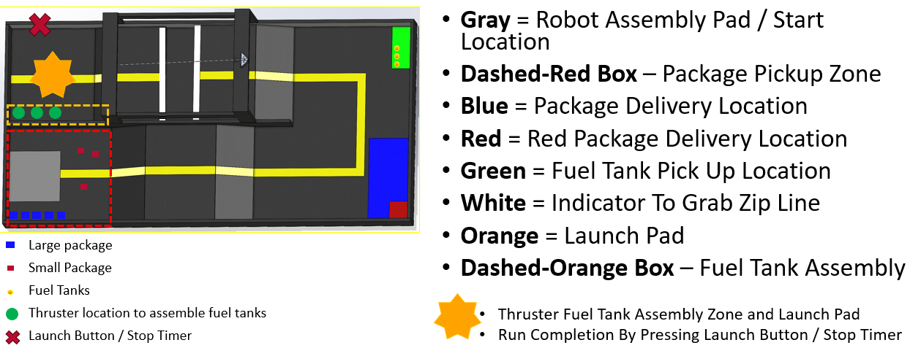
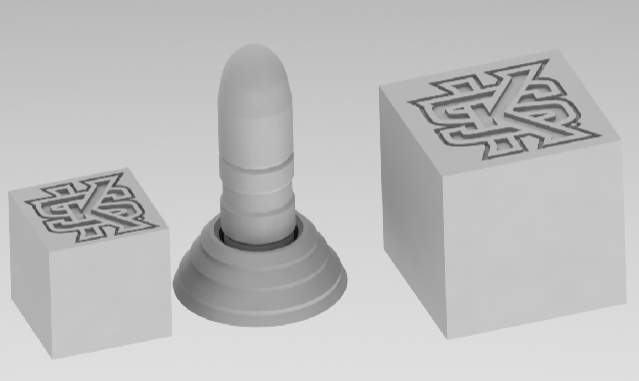

# CBU's Robot For the IEEE SoutheastCon Hardware Competition 2024

Welcome to the README for the codebase developed for the 2024 IEEE SoutheastCon Hardware Competition. This codebase is written in C++ and is designed to meet the requirements and challenges of the competition. Below, you will find information about the competition, the codebase, and how to set up the codebase.

## Table of Contents
- [Competition Overview](#competition-overview)
- [Codebase Overview](#codebase-overview)
- [Setup](#setup)
- [Strategy](#strategy)
- [License](#license)

---

## Competition Overview

The IEEE SoutheastCon Hardware Competition is an annual event that challenges participants to design, build, and program hardware systems to solve real-world problems. The competition may involve tasks related to robotics, automation, sensor integration, or other hardware-focused challenges.

*Labeled Competition Field*

For the 2024 competition, the challenge is to design and build a robot that can navigate a painted wooden competition field and complete a series of tasks. The first task is to wait in the starting area (gray) until the timer begins which is indicated by a green LED. The robot must then navigate the field and collect large & small packages and deposit them in the package delivery and red package delivery areas respectively. Next, the robot must navigate to the fuel tank pickup area (green) and collect the fuel tanks. The robot then has to traverse a crater by using the zip line or building a bridge across it to get to the fuel tank assembly area (dashed-orange box) to assemble the fuel tanks. Lastly the robot must push the launch button to complete the challenge. The robot must be able to complete the challenge within 3 minutes with more points being awarded for completing the challenge faster up to 1 minute and 45 seconds. The robot must also complete the challenge autonomously with no human input.

*Left to Right: Small Package, Fuel Tank & Thruster, Large Package*

## Strategy

### Simple Strategy

1. Wait for the green LED to turn on and start an internal timer.
1. Collect packages and deliver them to the appropriate areas.
1. Collect fuel tanks and deliver them to the fuel tank assembly area.
1. Push the launch button.

## Codebase Overview

## Setup

1. Clone the repository.
1. Download and install the [OpenCV](https://opencv.org/releases/) Library.
1. Download and install [CMake](https://cmake.org/download/).
1. Run `cmake -B <path-to-build> -S <path-to-source>`
1. Run `cmake --build <path-to-build>`
1. Run `./<path-to-build>/CBU_IEEE_ROBOTICS_2024` or `./<path-to-build>/CBU_IEEE_ROBOTICS_2024.exe` depending on your operating system.

## License

